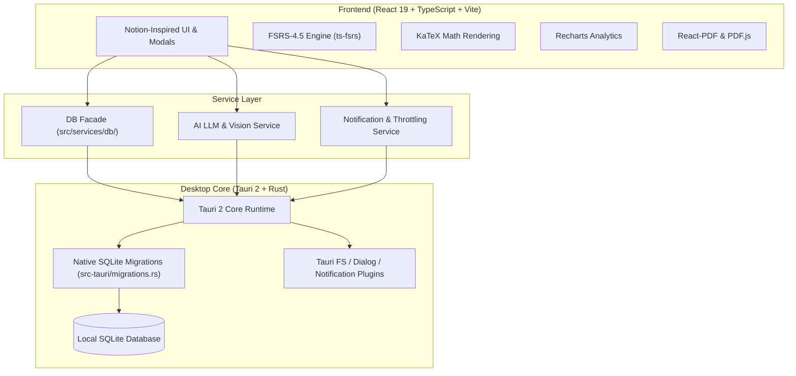

# ⚡ Oxide Deck

<div align="center">


**A high-performance, local-first, AI-augmented spaced repetition & mock exam platform.**  
*Engineered with Rust, Tauri 2, React 19, TypeScript, SQLite, and the FSRS-4.5 algorithm.*

[](https://tauri.app)
[](https://www.rust-lang.org)
[](https://react.dev)
[](https://www.typescriptlang.org)
[](https://sqlite.org)
[](https://github.com/open-spaced-repetition/fsrs4anki)
[](LICENSE)

</div>

---

## 📖 Overview

**Oxide Deck** is a modern desktop flashcard and exam preparation workstation designed for serious students and professionals. Unlike bloated cloud-only platforms, Oxide Deck is **local-first**, private, lightning-fast, and powered by the cutting-edge **FSRS-4.5 (Free Spaced Repetition Scheduler)** memory algorithm.

Beyond flashcards, Oxide Deck features an integrated **Exam & Past Paper Suite**: scan physical or PDF exam papers, simulate timed **Mock Exams** with AI variable mutations, and analyze error patterns (calculation slips, misread questions, conceptual gaps) to dramatically accelerate learning retention.

---

## ✨ Key Features

### 🧠 1. FSRS-4.5 Spaced Repetition Engine
- **Modern Memory Scheduling**: Implements the state-of-the-art Free Spaced Repetition Scheduler (`ts-fsrs`), outperforming legacy SM-2.
- **Configurable Retention Targets**: Calibrate desired retention rate from $70\%$ to $97\%$ per subject.
- **Deep Memory Modeling**: Accurately tracks Card Stability, Difficulty, Retrievability, and Review States (*New*, *Learning*, *Review*, *Relearning*).

### 🗂️ 2. Hierarchical Subject & Folder Organization
- **Structured Knowledge Tree**: Group cards and tests under Subjects $\rightarrow$ Nested Folders $\rightarrow$ Decks.
- **Drag & Drop**: Seamlessly move decks and nested folders with non-destructive live updates.
- **Personalized Visuals**: Custom emoji pickers and color-coded icons across all workspaces.

### ⚡ 3. AI-Powered Flashcard Creation
- **Multi-Modal Document Scanning**: Ingest PDFs, lectures, and documents with built-in text extraction and visual snippet matching.
- **Camera & Clipboard Vision**: Snap a photo or paste a screenshot directly from clipboard; images are automatically compressed into optimized WebP assets.
- **Web URL Extraction**: Provide article or documentation links to synthesize key definitions automatically.
- **LaTeX & KaTeX Support**: Native rendering for complex mathematical and scientific formulas (inline `$...$` and block `$$...$$`).

### 📝 4. Test Paper Scanning & Error Analytics
- **Exam Ingestion**: Digitize past papers with structured question breakdown, mark allocation, and official marking schemes.
- **Diagnostic AI Grading**: Analyzes student answers against marking criteria and classifies mistakes (*Conceptual*, *Misread*, *Calculation*, *Time-Management*).
- **Scores & Analytics Hub**: Real-time overview of grade distributions, mistake breakdowns, mastery curves, and revision volume.

### 🎯 5. Timed Mock Exam Arena
- **Exam Simulation**: Practice under authentic timed test conditions with countdown clocks and fullscreen focus.
- **Variable Variation Generation**: AI mutates values, equations, and algebra of real past papers so you can retake papers without memorizing raw numbers.
- **Flashcard AI Mocks**: Generates comprehensive test papers dynamically derived from your existing decks.
- **Safety Guards**: Styled in-app confirmation dialogs and navigation guards protect in-progress exams against accidental data loss.

### 🔄 6. Diverse Revision Modes
- **Classic Flashcard Flip**: Keyboard-driven reviews (<kbd>Space</kbd>, <kbd>1</kbd>–<kbd>4</kbd> rating keys).
- **Interactive Quiz Mode**: Multiple-choice format generated on the fly.
- **"Teach Me" Mode**: Socratic dialogue where AI tests your understanding through conversational questions.

### 🔔 7. Local Notifications & Study Reminders
- **Native Desktop & In-App Alerts**: Configurable daily study time reminders and due card threshold alerts.
- **Streak Saver Alerts**: Evening reminders on active study days to maintain learning streaks.
- **Quiet Hours (DND)**: Respects user-defined quiet intervals and sound toggles.

### 📤 8. Export, Import & QR Sharing
- **Deck Sharing via QR Codes**: Generate compressed, scan-friendly QR codes to import flashcards across devices without external servers.
- **Local JSON Backup**: Full database and deck-level export and import capabilities.

---

## 🛠️ Architecture & Tech Stack



| Layer | Technologies |
|---|---|
| **Desktop Framework** | [Tauri 2.0](https://tauri.app/) (Rust 2021) |
| **Frontend Framework** | [React 19](https://react.dev/), [TypeScript 5.8](https://www.typescriptlang.org/), [Vite 7](https://vitejs.dev/) |
| **Local Database** | SQLite via `@tauri-apps/plugin-sql` and Rust `rusqlite` migrations |
| **Spaced Repetition** | `ts-fsrs` (FSRS-4.5) |
| **Math & Visuals** | `KaTeX`, `lucide-react`, `recharts` |
| **Document Processing** | `pdfjs-dist`, `react-pdf` |
| **Styling** | Vanilla CSS Design System with light/dark glassmorphism |

---

## 🚀 Getting Started

### Prerequisites

1. **Node.js**: `v18.0+` or `v20.0+` (LTS recommended)
2. **Package Manager**: `pnpm` (or `npm` / `yarn`)
3. **Rust Toolchain**: `rustc` and `cargo` installed via [rustup.rs](https://rustup.rs/)
4. **OS Dependencies**:
   - **Windows**: WebView2 (pre-installed on Windows 10/11) and MSVC C++ build tools
   - **macOS**: Xcode Command Line Tools
   - **Linux**: `libwebkit2gtk-4.1-dev`, `build-essential`, `curl`, `libssl-dev`

### Installation & Development

1. **Clone the repository**:
   ```bash
   git clone https://github.com/your-username/oxide_deck.git
   cd oxide_deck
   ```

2. **Install dependencies**:
   ```bash
   pnpm install
   ```

3. **Run the desktop app in development mode**:
   ```bash
   pnpm tauri dev
   ```

4. **Build the production installer**:
   ```bash
   pnpm tauri build
   ```
   *The compiled binary and native installer (`.msi` / `.dmg` / `.AppImage`) will be available in `src-tauri/target/release/bundle/`.*

---

## 📂 Project Structure

```
oxide_deck/
├── src-tauri/               # Tauri 2 Desktop & Rust Backend
│   ├── src/
│   │   ├── lib.rs           # Tauri app entry & plugin initialization
│   │   ├── main.rs          # Application entrypoint
│   │   └── migrations.rs    # Database schema definitions & migrations
│   ├── tauri.conf.json      # Window, security & build configurations
│   └── Cargo.toml           # Rust crate dependencies
│
├── src/                     # Frontend Application
│   ├── components/          # Reusable UI components (ConfirmModal, MathText, PDFViewer, ToastBanner, etc.)
│   ├── pages/               # Top-level views
│   │   ├── Dashboard.tsx    # Retention metrics, due cards, quick actions
│   │   ├── Folders.tsx      # Subject/Folder/Deck explorer coordinator
│   │   ├── folders/         # Modals (SubjectModal, FolderModal, DeckModal, CardModal, DeckDetailView)
│   │   ├── CreateFlashcard.tsx # Multi-modal creation (Manual, Text, Image, PDF, Web)
│   │   ├── Revision.tsx     # Flip, Quiz, and Teach revision arenas
│   │   ├── Test.tsx         # Past paper scanning & test coordinator
│   │   ├── test/            # Decomposed test views (TestDetailView, TestEditView, TestListView, etc.)
│   │   ├── MockExam.tsx     # Timed mock exams, AI variable mutations, and grading
│   │   ├── Scores.tsx       # Diagnostics, error analytics & mastery charts
│   │   └── Settings.tsx     # AI models, FSRS parameters, notifications & themes
│   ├── services/            # Core business logic & data access
│   │   ├── db/              # Domain-split SQLite layer (subjects, folders, decks, flashcards, tests)
│   │   ├── llm.ts           # Vision OCR, flashcard generation & exam evaluation
│   │   ├── notificationService.ts # Throttled notification scheduling & study alerts
│   │   └── pdf.ts           # PDF structured parsing and text extraction
│   ├── utils/               # Helper utilities (image WebP compression, folderTree, qrCode)
│   ├── App.tsx              # App coordinator & navigation guards
│   └── App.css              # Theme tokens & glassmorphic styles
│
├── package.json
└── tsconfig.json
```

---

## ⚙️ Configuration & AI Models

Oxide Deck allows full customization of AI providers in the **Settings** tab:
- **API Endpoints**: Compatible with standard OpenAI-compatible endpoints, Anthropic, Google Gemini, or local models via [Ollama](https://ollama.ai/).
- **Vision Models**: Configure vision-capable models (e.g. `gpt-4o`, `claude-3-5-sonnet`, `llava`) for handwritten exam OCR and image-based flashcard generation.
- **FSRS Tuning**: Adjust request retention ($R$) and inspect individual card decay parameters directly from the UI.

---

## 🤝 Contributing

Contributions, issues, and feature requests are welcome!

1. Fork the repository
2. Create your feature branch (`git checkout -b feature/AmazingFeature`)
3. Commit your changes (`git commit -m 'Add some AmazingFeature'`)
4. Push to the branch (`git push origin feature/AmazingFeature`)
5. Open a Pull Request

---

## 📄 License

This project is licensed under the MIT License — see the [LICENSE](LICENSE) file for details.
