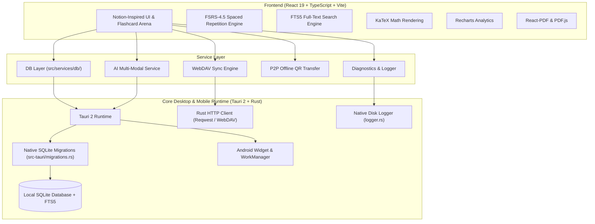

# ⚡ Oxide Deck

<div align="center">


**A fast, local-first, AI-powered flashcard app with modern spaced repetition.**  
*Built with Rust, Tauri 2, React 19, TypeScript, SQLite, and the FSRS-4.5 algorithm.*

[](https://tauri.app)
[](https://www.rust-lang.org)
[](https://react.dev)
[](https://www.typescriptlang.org)
[](https://sqlite.org)
[](https://github.com/open-spaced-repetition/fsrs4anki)
[](https://github.com/Xeb-Dev/oxide_deck)
[](LICENSE)

</div>

---

## 📖 Overview

**Oxide Deck** is a fast, distraction-free flashcard app designed to help you learn faster and remember longer. It pairs the scientific precision of the **FSRS-4.5 (Free Spaced Repetition Scheduler)** with powerful **AI card generation** tools that turn lecture notes, PDFs, images, and web articles into study-ready flashcards in seconds.

Unlike cloud-locked study tools, Oxide Deck is **100% local-first**. All your decks, cards, images, and study statistics stay stored securely on your device in an optimized SQLite database. Sync effortlessly to your own private cloud via WebDAV or share decks offline with peer-to-peer QR codes.

When you want to put your knowledge to the test, Oxide Deck also includes an integrated **Mock Exam Suite** to practice under real timed test conditions.

---

## 📥 Download & Quick Start

> **New to Oxide Deck?** Watch the quick video guide below on how to download and install Oxide Deck from GitHub on your device:

<div align="center">

<!-- PASTE YOUR VIDEO LINK / EMBED HERE -->
[](https://github.com/Xeb-Dev/oxide_deck/releases/latest)

<!-- 
Tip: You can also embed an MP4 video or GIF directly using standard Markdown or HTML:
<video src="https://path-to-your-video.mp4" controls="controls" width="100%"></video>
or 

-->

<br/>

[-0078D6?style=for-the-badge&logo=windows&logoColor=white)](https://github.com/Xeb-Dev/oxide_deck/releases/latest)
&nbsp;
[-3DDC84?style=for-the-badge&logo=android&logoColor=white)](https://github.com/Xeb-Dev/oxide_deck/releases/latest)

</div>

### 🚀 Simple 3-Step Setup

1. **Download the Installer**:
   - **Windows**: Download `OxideDeck-..._x64-windows-setup.exe` from the [Latest Release](https://github.com/Xeb-Dev/oxide_deck/releases/latest).
   - **Android**: Download `OxideDeck-...-mobile-android.apk` directly to your phone.
2. **Install**:
   - **Windows**: Run the setup `.exe` (if Windows SmartScreen appears, click *More info* $\rightarrow$ *Run anyway*).
   - **Android**: Tap the downloaded `.apk` and allow installation from your browser/files when prompted.
3. **Start Learning**: Open Oxide Deck, create your first deck or import notes via PDF/Image, and start your review!

---

## ✨ Key Features

### 🧠 1. FSRS-4.5 Spaced Repetition Engine
- **Smarter Scheduling**: Uses the state-of-the-art Free Spaced Repetition Scheduler (`ts-fsrs`), proven to outperform legacy SM-2 algorithms.
- **Personalized Weight Optimization**: Analyze your personal review history to fine-tune FSRS memory parameters ($w_{0}\dots w_{16}$) for your individual learning curve, with one-click reset to defaults.
- **Deep Memory Modeling**: Accurately tracks card stability, difficulty, retrievability, lapses, and learning states (*New*, *Learning*, *Review*, *Relearning*).

### ⚡ 2. Instant AI Flashcard Creation
- **PDF Study Studio**: Open PDF textbooks and slides in a dual-pane viewer to generate cards automatically or highlight specific text and visual snippets.
- **AI Diagram Extraction**: Automatically detects, crops, and attaches diagrams, formulas, and charts directly to your flashcards.
- **Vision OCR & Camera Capture**: Take photos of handwritten notes or paste screenshots from your clipboard—images are automatically converted to lightweight WebP files.
- **Web Article Ingestion**: Paste documentation or article links to instantly extract definitions, core ideas, and study points.
- **LaTeX & KaTeX Support**: Native rendering for complex math and science formulas (inline `$...$` and block `$$...$$`).
- **Dual-Sided Images**: Attach high-resolution images to both the front and back of any card.

### 🔄 3. Flexible Revision Modes & AI Tutors
- **Classic Flashcard Flip**: Fast, keyboard-friendly card reviews (<kbd>Space</kbd>/<kbd>Enter</kbd> to flip, <kbd>1</kbd>–<kbd>4</kbd> to rate, Arrow keys to browse) with smooth touch swipe gestures on mobile.
- **Interactive Quiz Mode**: Automatically turns your flashcards into multiple-choice and short-answer quizzes.
- **Socratic "Teach Me" Mode**: Conversational AI testing where an AI tutor asks questions to test whether you truly understand the concept.
- **Custom Teaching Personas**: Build your own AI study partners with customized pedagogical styles (e.g. Socratic Professor, ELI5 Mentor, Strict Examiner).

### 🗂️ 4. Clean Knowledge Tree & Global Search
- **Organized Hierarchy**: Structure your library cleanly into Subjects $\rightarrow$ Nested Folders $\rightarrow$ Decks.
- **Drag & Drop**: Reorganize folders and cards easily with live drop zones and auto-scrolling.
- **Personalized Styling**: Assign custom emojis and color tags to subjects, folders, and decks.
- **Instant Full-Text Search**: Press <kbd>Ctrl+K</kbd> (or <kbd>Cmd+K</kbd>) to instantly search across all your cards, decks, tags, and notes using SQLite FTS5.

### ☁️ 5. Private Cloud Sync & Offline QR Sharing
- **WebDAV Sync**: Seamlessly sync your study progress across Desktop and Android using Nextcloud, ownCloud, Fastmail, or any custom WebDAV server.
- **Background Sync**: Automatic sync intervals and Android WorkManager support to keep your flashcards up to date on mobile.
- **100% Offline QR Sharing**: Share decks directly between devices with compressed high-density QR codes—no servers or Wi-Fi required.
- **Built-in Scanner**: Camera scanner with flashlight toggle, pinch zoom, tap focus, and image upload.

### 📝 6. Integrated Past Paper & Mock Exam Suite
- **Digitize Past Papers**: Scan physical or PDF tests into structured questions and marking criteria.
- **Timed Practice Arena**: Simulate real exam pressure with custom countdown timers and distraction-free mode.
- **Variable Mutation Mode**: AI alters the numbers and variables in past questions so you practice problem-solving instead of memorizing answers.
- **Flashcard Mocks**: Generate dynamic practice tests created directly from your flashcard decks.
- **Diagnostic Grading**: Automated marking that categorizes errors into *Conceptual*, *Calculation*, *Misread*, or *Time-Management* slips.

### 📊 7. Mastery Analytics & Daily Habits
- **Retention & Mastery Charts**: Visualize your memory decay curves, card distribution, and revision volume over time.
- **Daily Streak Tracking**: Build study habits with configurable daily goals, streak saver alerts, and quiet hours (DND).
- **Android Home Widget**: View your current streak and due cards right on your phone's home screen.
- **Native Diagnostics**: Built-in multi-level logger with disk persistence and one-click JSON export.

---

## 🛠️ Architecture & Tech Stack



| Layer | Technologies |
|---|---|
| **App Framework** | [Tauri 2.0](https://tauri.app/) (Rust 2021) — Desktop (Windows, macOS, Linux) & Mobile (Android) |
| **Frontend** | [React 19](https://react.dev/), [TypeScript 5.8](https://www.typescriptlang.org/), [Vite 7](https://vitejs.dev/) |
| **Local Database** | SQLite via `@tauri-apps/plugin-sql` with Rust native migrations & FTS5 full-text indexing |
| **Spaced Repetition** | `ts-fsrs` (FSRS-4.5 Algorithm) |
| **AI Providers** | Google Gemini, Groq, Local LLMs ([Ollama](https://ollama.ai/) / LM Studio) with per-task routing |
| **Math & Visuals** | `KaTeX`, `lucide-react`, `recharts` |
| **Document Processing** | `pdfjs-dist`, `react-pdf`, automated WebP image compression |
| **Sync & Networking** | Custom WebDAV sync engine, `reqwest` with Rustls TLS, Android WorkManager |
| **Offline Sharing** | `fflate` compression, `qrcode`, `jsqr` |
| **Styling** | Vanilla CSS Design System with dark and light glassmorphism |

---

## ⌨️ Keyboard Shortcuts & Gestures

| Area | Shortcut / Action | Description |
|---|---|---|
| **Global** | <kbd>Ctrl</kbd> + <kbd>K</kbd> / <kbd>Cmd</kbd> + <kbd>K</kbd> | Open Global Full-Text Search |
| **Flashcards** | <kbd>Space</kbd> or <kbd>Enter</kbd> | Flip current flashcard |
| **Flashcards** | <kbd>1</kbd> | Rate card **Again** (Fail) |
| **Flashcards** | <kbd>2</kbd> | Rate card **Hard** |
| **Flashcards** | <kbd>3</kbd> | Rate card **Good** |
| **Flashcards** | <kbd>4</kbd> | Rate card **Easy** |
| **Flashcards** | <kbd>←</kbd> / <kbd>→</kbd> | Browse previous / next card |
| **Mobile** | Swipe Left / Right | Browse next / previous card |
| **Mobile** | Tap Screen | Flip card front/back |

---

## 🛠️ Building from Source (For Developers)

If you wish to contribute or build Oxide Deck from source, follow these setup steps:

### Prerequisites

1. **Node.js**: `v18.0+` or `v20.0+` (LTS recommended)
2. **Package Manager**: `pnpm` (or `npm` / `yarn`)
3. **Rust Toolchain**: `rustc` and `cargo` installed via [rustup.rs](https://rustup.rs/)
4. **OS Build Tools**:
   - **Windows**: Microsoft Visual Studio C++ Build Tools & WebView2 (pre-installed on Windows 10/11)
   - **macOS**: Xcode Command Line Tools
   - **Linux**: `libwebkit2gtk-4.1-dev`, `build-essential`, `curl`, `libssl-dev`
   - **Android (Optional)**: Android Studio, Android SDK, NDK, and JDK 17

### Installation & Development

1. **Clone the repository**:
   ```bash
   git clone https://github.com/Xeb-Dev/oxide_deck.git
   cd oxide_deck
   ```

2. **Install dependencies**:
   ```bash
   pnpm install
   ```

3. **Start desktop development server**:
   ```bash
   pnpm tauri dev
   ```

4. **Start Android development server**:
   ```bash
   pnpm tauri android dev
   ```

---

## 📦 Building Releases

Oxide Deck includes an automated script for packaging Windows installers and Android APKs:

```bash
# Run the automated release pipeline
pnpm build:release
```

Or build individual platform bundles with the Tauri CLI:

```bash
# Windows / Desktop Installer (.msi / .exe)
pnpm tauri build

# Android Package (.apk)
pnpm tauri android build --apk
```

---

## ⚙️ AI Configuration & Model Routing

Customize your AI settings under **Settings $\rightarrow$ AI Settings**:

- **Multiple Providers**: Connect Google Gemini, Groq, or self-hosted local models (via Ollama or LM Studio).
- **Task Routing**: Choose which model handles specific tasks (e.g. use a ultra-fast Groq model for flashcard quizzes and a vision-capable Gemini model for PDF scanning).
- **Vision OCR & Diagrams**: Enable automatic visual snippet cropping and diagram extraction.
- **Custom Personas**: Configure custom Socratic tutor personalities and feedback styles under **Settings $\rightarrow$ Personas**.

---

## 🤝 Contributing

Contributions, issues, and feature suggestions are welcome!

1. Fork the repository
2. Create your feature branch (`git checkout -b feature/AmazingFeature`)
3. Commit your changes (`git commit -m 'Add some AmazingFeature'`)
4. Push to the branch (`git push origin feature/AmazingFeature`)
5. Open a Pull Request

---

## 📄 License

This project is licensed under the **GNU General Public License v3.0** — see the [LICENSE](LICENSE) file for details.
